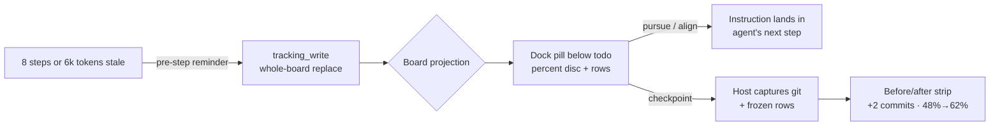

# dsh-rich-tracking

**Percent-progress scoreboard for [DeepSeek Harness](https://github.com/deepseek-ai/deepseek-harness)** — a docked board below the todo pill showing rows with live percents derived from artifact truth, checkpoints with host-captured git state, and operator whip-actions that land in the agent's next step as attributed instructions.

> 进度记分板：停在 todo 胶囊下方的百分比看板——每行百分比来自工件事实，检查点由宿主抓取 git 真实状态，pursue/align/dismiss 直接鞭策到 agent 的下一步。



## Install

```sh
dsh plugin --profile web add dsh-rich-tracking
```

Restart the `dsh web` process — `tracking_write` and `tracking_checkpoint` become available to every agent preset, and the board renders in the conversation dock (order 5: below the todo pill, above the goal bar).

## The grammar

**todos are the micro plan (this turn); tracking is the mission scoreboard (across turns).** The board deliberately does not reset on `turn/start` — waves, milestones, and multi-session objectives survive until every row is 100 or you dismiss it.

### Rows and percent honesty

Each row is `{id, label, percent, status?, note?, evidence?, items?}`:

- `percent` = **(acceptance items that hold right now) / (total)** in the row's owning artifacts — plan checkboxes, landed receipts, verified readbacks. Never an impression.
- Every row with `percent >= 1` **must** carry `evidence` naming that basis (paths + checked/total). Validation rejects a percent without evidence — the schema enforces what the operator calls "not vibes".
- `percent: 100` requires every item checked AND the owning receipt to exist. A 100% row dims but stays visible until the whole board is done.
- `items` (optional, 1-20): the row's acceptance checklist `[{ label, done }]` — click the row on the board to expand it in place. Done items grey out with strikethrough; open items stay readable in the primary color. When items are present, `percent` MUST equal `round(done/total × 100)`; validation rejects a mismatch, so the visible checklist always adds up to the shown percent.
- Overall completion is item-weighted: every item is one unit; a row without items contributes one unit at `percent/100`. With no items anywhere this is exactly the rounded mean of row percents — legacy boards keep their math.
- Rows: 1-12 (aim 3-7), stable ascii ids (`w2-fleet`) so checkpoints and actions can reference them.

### Checkpoints — receipts, not narration

`tracking_checkpoint` makes the **host** capture git branch/HEAD/dirty-state plus the frozen board. The model never types git facts. The board shows the before/after strip: `+2 commits · overall 48% → 62% · W2 fleet 30% → 55%`.

### Operator actions (the whip)

Per row and board-wide: **Pursue** (make this row the next focus), **Delegate** (hand the row to a background subagent), **Align** (re-derive every percent from artifacts — the lie-detector pass), **Checkpoint**, **Dismiss**. Pursue/delegate/align land as attributed instructions in the agent's next step (steer when running, followup when idle); dismissal is a quiet note — and any later `tracking_write` with real state resurrects a dismissed board, because truth beats finality.

**Delegate** sends the agent a self-contained delegation brief: the row's label, percent, item checklist with done flags, evidence, and note, plus the requirements — a background subagent with read/write access, scoped strictly to the row's task and subtasks, the subagent keeping its **own** `tracking_write` board (scoped to that task, percents updated per step), and verifiable receipts (commits, test results, file paths) folded back into the parent row when the report lands.

### /track — the forced ledger sync

`/track` (optionally `/track <message>`) is a host command in the `/plan` family: it injects the **full ledger plus the tracking doctrine** into the agent's next step as a user-visible message — every row with percent, status, item flags, evidence, and note, followed by the re-derivation directive (read the named artifacts — documentation, code, receipts, user context — recompute percent as checked/total, fix stale items/prose, write the corrected board). With no board yet, it injects the creation directive. The trailing message rides along as the operator's own words. While a live board exists, every user submit also carries a one-line board reminder at the turn's first step (deduped whenever richer tracking context — a `/track` sync, a whip instruction, or a staleness reminder — is already in the assembly).

### The living-ledger cadence

The announcement teaches the step-bound duty: `tracking_write` after **every** completed task/step/todo whose artifact truth changed — refreshed percents and item flags — and row prose (label, note, evidence, items) updated whenever the underlying details shift. The board always describes current reality, not a milestone snapshot.

### The refresh loop

Boards go stale while the agent works. After **8 assistant steps or 6k output tokens** without a `tracking_write`, the next model request carries a labeled reminder naming the stale rows. One per turn; none when the board is dismissed or complete.

## How it compares

| Capability | todo_write | goal bar | rich-questions | **rich-tracking** |
|---|---|---|---|---|
| Lifetime | per turn | mission (service) | per tool call | **mission (session events)** |
| Progress signal | status counts | phase label | answered/total | **per-row % + overall, evidence-bound** |
| Operator actions | none | pause/resume/edit | answer/reroll/push | **pursue/delegate/align/checkpoint + /track** |
| Agent whip | description | wrap-up contexts | pre-flight instructions | **pre-step refresh + action instructions** |
| Evidence binding | none | objective text | sources/insights | **evidence per row + git-captured checkpoints** |
| Where | dock 0 | dock 10 | composer seat | **dock 5** |

## Architecture

```
src/host.js            Node half — tracking_write + tracking_checkpoint tools, the
                       'tracking' session projection (no turn reset), the agent/pre-step
                       refresh reminder, loopback-fenced /api/rich-tracking/action.
                       Node builtins only.
src/tracking-engine.js Pure engine — board validation (self-repairing messages),
                       projection fold, wire view, percent math. Host-only.
src/client.bundle.js   Browser half — the dock board: percent-disc pill, rows with
                       hover-revealed actions, checkpoint before/after strip, tooltips.
                       React + client primitives only.
cordis.patch.yml       Bundle patch inserting the plugin row.
```

State is session events (`tracking/write`, `tracking/checkpoint`, `tracking/decision`) — persistence, reload, and fork ride the existing JSONL log; the client subscribes through the projection wire. Forks inherit the board and evolve independently.

## How updates flow

No refresh, no polling: `tracking_write` appends a session event → the projection recomputes → the dock receives the new view on the same wire the todo panel uses. The board moves the moment the agent writes it — and so does the whip: pressing pursue/align appends a decision and delivers the instruction to the agent's next step (steer when running, followup when idle, quiet inject for dismissals), rendered in the transcript as an attributed context node, never a fake user message.

## License

[MIT](LICENSE)

<!-- demo checkpoint marker -->
